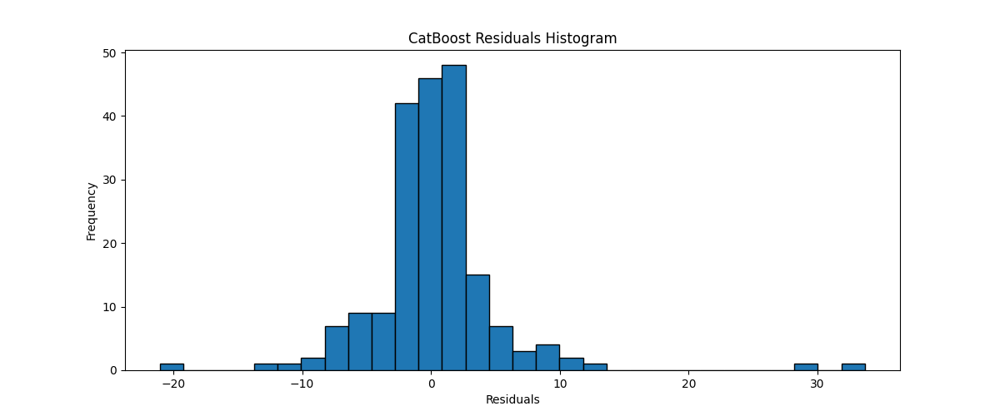
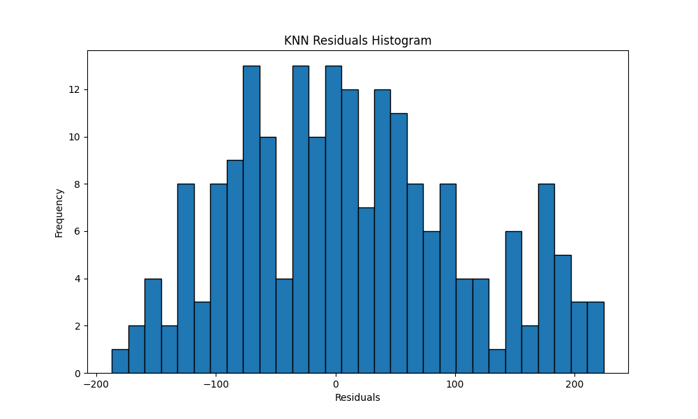
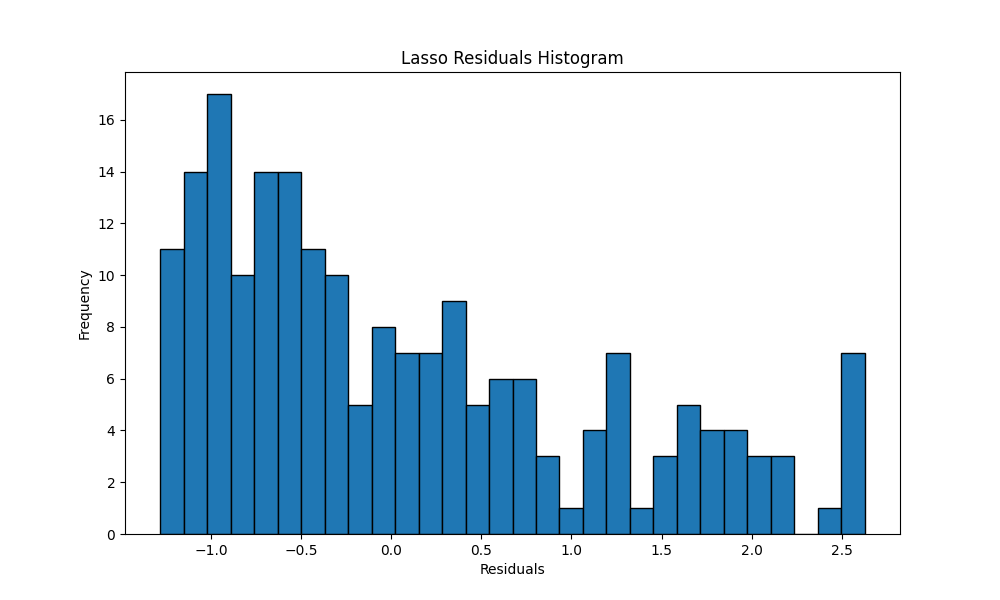
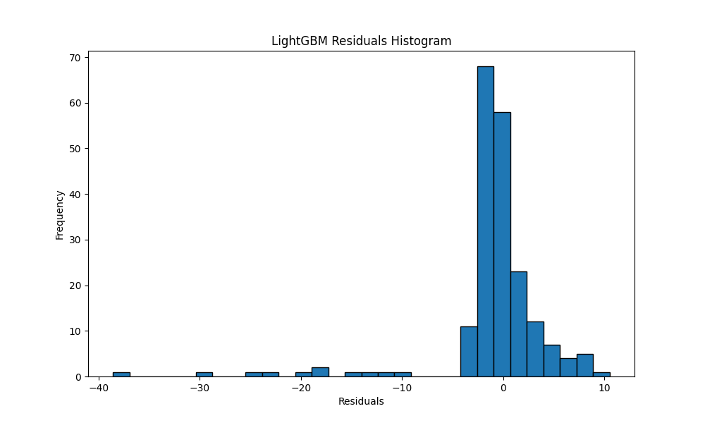
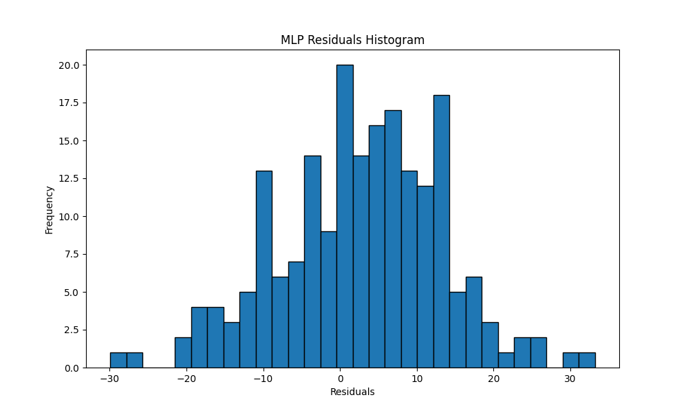
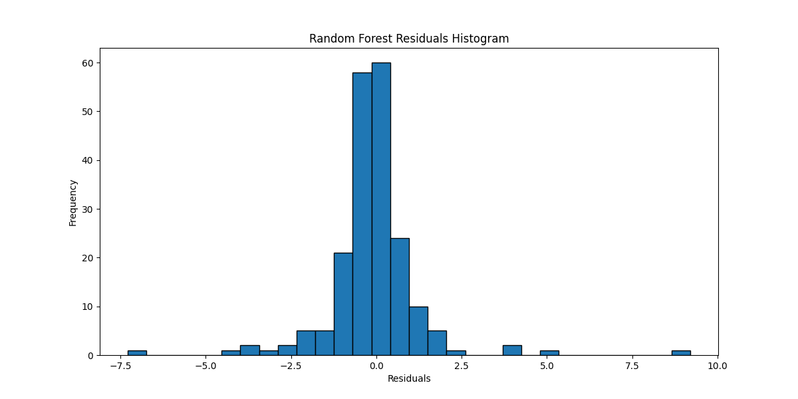
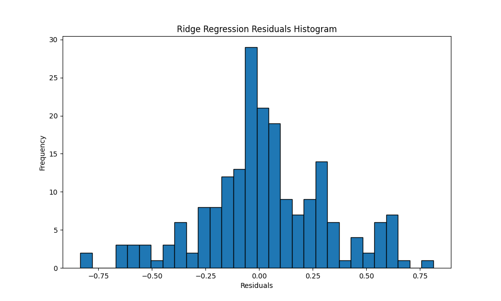
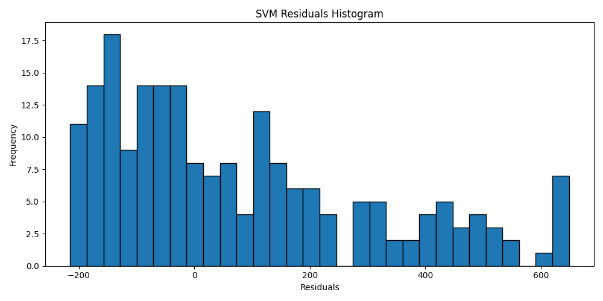
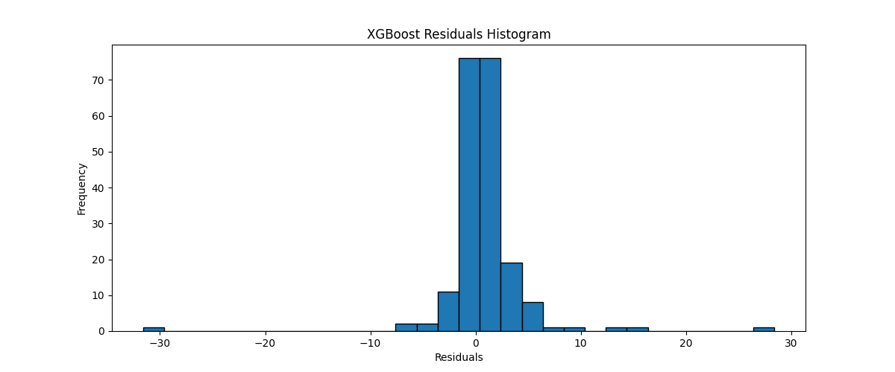

# Super Market Sales Prediction

> A machine learning project for predicting super market sales using various regression models.

---

## Table of Contents

- [Description](#description)
- [How to Use](#how-to-use)
- [Models and Evaluation](#models-and-evaluation)
- [Histogram](#histogram)
- [Residual Plots](#residual-plots)
- [Scatter Plots](#scatter-plots)
- [Installation](#installation)
- [Contributing](#contributing)
- [License](#license)

---

## Description

The "Super Market Sales Prediction" project is a machine learning-based application that predicts super market sales based on various features such as branch, city, customer type, gender, product line, unit price, quantity, tax, cost of goods sold, gross income, and customer rating. This project demonstrates the use of multiple regression algorithms to make sales predictions.

Key features of the project include:
- Preprocessing and encoding of categorical features.
- Training and evaluation of different regression models.
- Visualization of model performance.

---

## How to Use

To use this project, follow these steps:

1. Clone the repository to your local machine:

   ```shell
   git clone https://github.com/pypi-ahmad/Super-Market-Sales-Prediction.git
   ```

2. Install the required dependencies:

   ```shell
   pip install -r requirements.txt
   ```

3. Run the Flask application:

   ```shell
   python app.py
   ```

4. Open a web browser and go to `http://localhost:5000` to access the prediction form.

5. Select a regression model, enter the required input values, and click "Predict."

6. View the prediction results on the next page.

---

## Models and Evaluation

The project utilizes various regression models, including:
- XGBoost Regressor
- Support Vector Machine (SVM)
- Ridge Regression
- Random Forest Regressor
- MLP Regressor
- LightGBM Regressor
- Lasso Regression
- K-Nearest Neighbors (KNN)
- CatBoost Regressor

Model performance is evaluated using metrics such as Mean Absolute Error (MAE) and Root Mean Squared Error (RMSE).


---

## Histogram

Histograms of residuals for different models provide insights into the distribution of prediction errors.

1. CatBoost Residual Histogram
   

2. KNN Residual Histogram
   

3. Lasso Residual Histogram
   

4. LightGBM Residual Histogram
   

5. MLP Residual Histogram
   

6. Random Forest Residual Histogram
   

7. Ridge Residual Histogram
   

8. SVM Residual Histogram
   

9. XGBoost Residual Histogram
   

---

## Residual Plots

Residual plots for different models help visualize the relationship between predicted and actual values.

1. CatBoost Residual Plot
   

2. KNN Residual Plot
   

3. Lasso Residual Plot
   

4. LightGBM Residual Plot
   

5. MLP Residual Plot
   

6. Random Forest Residual Plot
   

7. Ridge Residual Plot
   

8. SVM Residual Plot
   

9. XGBoost Residual Plot
   

---

## Scatter Plots

Scatter plots for different models show the distribution of predicted values against actual values.

1. CatBoost Scatter Plot
   

2. KNN Scatter Plot
   

3. Lasso Scatter Plot
   

4. LightGBM Scatter Plot
   

5. MLP Scatter Plot
   

6. Random Forest Scatter Plot
   

7. Ridge Scatter Plot
   

8. SVM Scatter Plot
   

9. XGBoost Scatter Plot
   

---

## Installation

To run this project locally, ensure you have Python and Git installed. Follow the steps in the "How to Use" section above.

---

## Contributing

Contributions are welcome! If you would like to contribute to this project, please fork the repository and create a pull request. Feel free to open issues for bug reports or feature requests.

---

## License

This project is licensed under the MIT License. See the [LICENSE](LICENSE) file for details.
