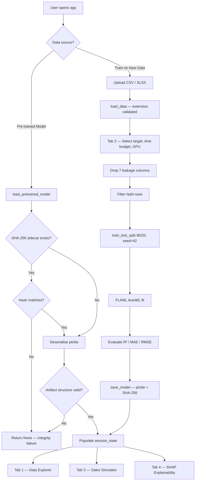

# Supermarket Sales AI Command Center

[](https://www.python.org/)
[](https://streamlit.io/)
[](https://www.docker.com/)
[](https://microsoft.github.io/FLAML/)
[]()

An end-to-end AutoML regression platform built with **Streamlit** and **FLAML**.  
Upload a dataset, train a model, run single-row predictions, and inspect feature
importance with SHAP — all from a single browser tab.

---

## Table of Contents

1. [Project Overview](#project-overview)
2. [Architecture Overview](#architecture-overview)
3. [System Flow](#system-flow)
4. [Data Model & Session State](#data-model--session-state)
5. [Core Modules](#core-modules)
6. [Security Model](#security-model)
7. [Dataset Schema](#dataset-schema)
8. [Setup & Installation](#setup--installation)
9. [Running the Application](#running-the-application)
10. [CLI Training Pipeline](#cli-training-pipeline)
11. [Docker Deployment](#docker-deployment)
12. [Testing](#testing)
13. [Project Structure](#project-structure)
14. [Limitations & Known Constraints](#limitations--known-constraints)

---

## Project Overview

| Aspect | Detail |
|--------|--------|
| **Goal** | Predict the `Total` sales amount for a supermarket transaction using automated machine learning. |
| **ML Engine** | [FLAML](https://microsoft.github.io/FLAML/) AutoML — regression task, R² metric, time-budgeted search over CatBoost, XGBoost, LightGBM, and scikit-learn estimators. |
| **UI** | Streamlit wide-layout app with four tabs: Data Explorer, AutoML Training Lab, Sales Simulator, Model Explainability. |
| **Explainability** | SHAP beeswarm (global) and waterfall (local) plots with automatic categorical encoding. |
| **Artifact Format** | Single pickle bundle (`automl_model.pkl`) containing the trained model, feature list, column metadata, evaluation metrics, and config. A `.sha256` sidecar file provides tamper detection. |

---

## Architecture Overview

The application consists of two independent entry points that share the same
artifact format:

```
┌──────────────────────────────────────────────────────┐
│                   Streamlit UI (app.py)               │
│                                                      │
│  ┌────────────┐ ┌──────────────┐ ┌────────────────┐ │
│  │   Tab 1    │ │    Tab 2     │ │     Tab 3      │ │
│  │   Data     │ │   AutoML     │ │    Sales       │ │
│  │  Explorer  │ │ Training Lab │ │   Simulator    │ │
│  └────────────┘ └──────┬───────┘ └───────┬────────┘ │
│                        │                 │           │
│  ┌────────────┐        ▼                 ▼           │
│  │   Tab 4    │   save_model()    model.predict()    │
│  │   SHAP     │        │                             │
│  │ Explainer  │        ▼                             │
│  └────────────┘  automl_model.pkl                    │
│                  automl_model.pkl.sha256              │
└──────────────────────────────────────────────────────┘

┌──────────────────────────────────────────────────────┐
│            CLI Pipeline (train_automl.py)             │
│                                                      │
│  supermarket_sales.csv ──▶ preprocess ──▶ FLAML fit  │
│                                  │                   │
│                                  ▼                   │
│                           automl_model.pkl           │
│                           automl_model.pkl.sha256    │
└──────────────────────────────────────────────────────┘
```

Both paths produce an identical artifact dict with keys:
`model`, `features`, `column_metadata`, `metrics`, `config`.

---

## System Flow



---

## Data Model & Session State

### Streamlit Session State Keys

| Key | Type | Purpose |
|-----|------|---------|
| `active_model` | FLAML `AutoML` instance or `None` | The trained model used for predictions. |
| `active_meta` | `dict` or `None` | Full artifact bundle (model + features + column_metadata + metrics + config). |
| `data_df` | `pd.DataFrame` or `None` | The currently loaded dataset for EDA and SHAP background data. |
| `uploaded_filename` | `str` or `None` | Guards against redundant re-parsing of the same upload. |
| `last_prediction_input` | `pd.DataFrame` | Most recent simulator input row, used by Tab 4 for local SHAP. |
| `last_prediction_value` | `float` | The predicted value from the simulator. |

### Artifact Dict Schema

```python
{
    "model":           AutoML,        # fitted FLAML AutoML object
    "features":        list[str],     # ordered feature column names
    "column_metadata": {              # per-column type info
        "col_name": {
            "type": "numeric",        # or "categorical"
            "min": float,             # numeric only
            "max": float,             # numeric only
            "mean": float,            # numeric only
            "options": list[str],     # categorical only
        }
    },
    "metrics":         {"r2": float, "mae": float, "mse": float},
    "config":          {"target": str, "app_title": str},
}
```

---

## Core Modules

### `app.py` (534 lines) — Streamlit UI

| Function | Line | Description |
|----------|------|-------------|
| `load_data(file)` | 43 | Reads CSV or XLSX from an uploaded file object. Validates the extension; raises `ValueError` on unsupported types. Cached with `@st.cache_data`. |
| `_compute_file_sha256(file_path)` | 54 | Streams a file in 8 KiB chunks and returns its SHA-256 hex digest. |
| `get_column_metadata(df)` | 62 | Inspects each column and returns a dict mapping column names to their type (`numeric` / `categorical`) and summary statistics. |
| `save_model(automl, features, metadata, metrics, config)` | 80 | Pickles the artifact bundle to `automl_model.pkl` and writes the SHA-256 digest to `automl_model.pkl.sha256`. |
| `load_pretrained_model()` | 93 | Loads the pickle, optionally verifies the SHA-256 sidecar, validates the artifact structure (required keys: `model`, `features`, `column_metadata`, `metrics`, `config`), and returns the bundle or `None`. |
| `main()` | 115 | Streamlit entry point — sidebar config, four tabs. |

**Tab 1 — Data Explorer:** Row/column/missing-value metrics, interactive histogram (Plotly), correlation heatmap, categorical bar charts.

**Tab 2 — AutoML Training Lab:** Target column selector, time budget slider (30–600 s, default 60), GPU checkbox, leakage column removal, NaN filtering, FLAML fit, R²/MAE/RMSE display, one-click model save.

**Tab 3 — Sales Simulator:** Dynamically generates a form from `column_metadata` — `st.selectbox` for categoricals, `st.number_input` (min/max/mean guardrails) for numerics, `st.text_input` for unknowns. Displays the predicted value as a metric card.

**Tab 4 — Model Explainability:** Builds a `shap.Explainer` over 50 background samples. Categorical columns are integer-encoded with a decode wrapper so SHAP can compute perturbations. Renders a beeswarm plot (global importance) and, if a simulator prediction exists, a waterfall plot (local explanation). Gracefully degrades if SHAP is not installed.

### `train_automl.py` (155 lines) — CLI Pipeline

| Constant / Function | Description |
|---------------------|-------------|
| `DATA_SOURCE` | `"supermarket_sales.csv"` |
| `TARGET` | `"Total"` |
| `TIME_BUDGET` | `90` seconds |
| `MODEL_FILE` | `"automl_model.pkl"` |
| `main()` | Loads CSV → validates target column exists → drops 7 leakage columns → drops NaN rows → captures column metadata → 80/20 split (seed 42) → FLAML fit (R² metric, GPU via `USE_GPU` env var) → evaluates → saves pickle + SHA-256 sidecar. |

---

## Security Model

| Mechanism | Implementation | Scope |
|-----------|---------------|-------|
| **File type validation** | `load_data()` checks the file extension (`.csv` / `.xlsx`) and raises `ValueError` for anything else. | Prevents arbitrary file parsing in the upload flow. |
| **SHA-256 integrity check** | `save_model()` writes a `.sha256` sidecar. `load_pretrained_model()` compares the sidecar digest against the recomputed hash of the pickle file. Mismatch → returns `None`. | Detects accidental or intentional model tampering. |
| **Artifact structure validation** | `load_pretrained_model()` asserts the deserialized object is a `dict` containing exactly the five required keys. | Rejects malformed or unexpected pickle contents. |
| **Graceful SHAP degradation** | SHAP import is wrapped in `try/except ImportError`; Tab 4 shows an error banner instead of crashing when SHAP is absent. | Keeps the app functional without optional dependencies. |

> **Known risk:** Model artifacts are Python pickles. Pickle deserialization can execute
> arbitrary code. The SHA-256 sidecar mitigates accidental corruption but does **not**
> protect against a sophisticated attacker who replaces both files. Only load model files
> from trusted sources.

---

## Dataset Schema

The bundled `supermarket_sales.csv` contains 17 columns:

| Column | Type | Dropped as Leakage |
|--------|------|--------------------|
| Invoice ID | object | Yes |
| Branch | object | No |
| City | object | No |
| Customer type | object | No |
| Gender | object | No |
| Product line | object | No |
| Unit price | float64 | No |
| Quantity | int64 | No |
| Tax 5% | float64 | Yes |
| Total | float64 | **Target** |
| Date | object | Yes |
| Time | object | Yes |
| Payment | object | No |
| cogs | float64 | Yes |
| gross margin percentage | float64 | Yes |
| gross income | float64 | Yes |
| Rating | float64 | No |

After leakage removal the model trains on 9 feature columns:
`Branch`, `City`, `Customer type`, `Gender`, `Product line`, `Unit price`, `Quantity`, `Payment`, `Rating`.

---

## Setup & Installation

### Prerequisites

- Python 3.10 or later
- `pip` package manager

### 1. Clone the repository

```bash
git clone https://github.com/pypi-ahmad/Super-Market-Sales-Prediction.git
cd Super-Market-Sales-Prediction
```

### 2. Create a virtual environment (recommended)

```bash
python -m venv .venv

# Windows PowerShell
.\.venv\Scripts\Activate.ps1

# Linux / macOS
source .venv/bin/activate
```

### 3. Install dependencies

All 13 dependencies are pinned to exact versions for reproducibility:

```bash
pip install -r requirements.txt
```

<details>
<summary>Dependency list</summary>

| Package | Version | Role |
|---------|---------|------|
| flaml | 2.5.0 | AutoML engine |
| streamlit | 1.53.1 | Web UI framework |
| pandas | 2.3.3 | Data manipulation |
| plotly | 6.5.2 | Interactive charts (Tab 1) |
| openpyxl | 3.1.5 | Excel file reading |
| matplotlib | 3.10.8 | SHAP plot rendering |
| numpy | 2.3.5 | Numerical operations |
| scikit-learn | 1.8.0 | Metrics and train/test split |
| pytest | 9.0.2 | Test framework |
| catboost | 1.2.8 | FLAML estimator backend |
| xgboost | 3.1.3 | FLAML estimator backend |
| lightgbm | 4.6.0 | FLAML estimator backend |
| shap | 0.50.0 | Model explainability |

</details>

---

## Running the Application

### Start the Streamlit app

```bash
streamlit run app.py
```

Open **http://localhost:8501** in your browser.

### Application walkthrough

1. **Sidebar** — Choose *Use Pre-trained Model* (loads `automl_model.pkl` if it exists)
   or *Train on New Data* (enables the file uploader for CSV/XLSX).
2. **Tab 1 — Data Explorer** — View row/column counts, missing values, histograms,
   a correlation heatmap, and categorical distributions.
3. **Tab 2 — AutoML Training Lab** — Select the target column, set a time budget
   (30–600 seconds), optionally enable GPU, and click *Start Training*.
   The pipeline drops leakage columns, filters NaN rows, runs FLAML, and displays
   R², MAE, and RMSE. The model is saved to disk automatically.
4. **Tab 3 — Sales Simulator** — A dynamic form is built from the trained model's
   metadata. Fill in values and click *Predict Sales* to see the predicted amount.
5. **Tab 4 — Model Explainability** — Global feature importance (beeswarm) and
   per-prediction explanations (waterfall) powered by SHAP.

### Streamlit configuration

The file `.streamlit/config.toml` sets:

| Setting | Value |
|---------|-------|
| `maxUploadSize` | 1024 MB |
| `headless` | true |
| `theme.base` | dark |
| `theme.primaryColor` | #ff4b4b |

---

## CLI Training Pipeline

Train a model headlessly from `supermarket_sales.csv` without launching the UI:

```bash
python train_automl.py
```

The CLI pipeline uses a 90-second time budget and writes:
- `automl_model.pkl` — serialized artifact bundle
- `automl_model.pkl.sha256` — integrity digest

### Enable GPU

```bash
# Windows PowerShell
$env:USE_GPU="1"
python train_automl.py

# Linux / macOS
USE_GPU=1 python train_automl.py
```

The `USE_GPU` environment variable is forwarded to FLAML's `use_gpu` setting.

---

## Docker Deployment

### Build and run with Docker Compose

```bash
docker-compose up --build
```

Open **http://localhost:8501**.

### Container details

| Property | Value |
|----------|-------|
| Base image | `python:3.13-slim` |
| System packages | `build-essential`, `libgomp1` (required by LightGBM/XGBoost) |
| Exposed port | 8501 |
| Restart policy | `unless-stopped` |
| Environment | `PYTHONUNBUFFERED=1` |

### Build manually without Compose

```bash
docker build -t supermarket-sales-ai .
docker run -p 8501:8501 supermarket-sales-ai
```

---

## Testing

### Run the full suite

```bash
pytest -q
```

22 tests across four categories:

| Category | Directory | Tests | Coverage |
|----------|-----------|-------|----------|
| Unit | `tests/unit/` | 9 | Helper functions: metadata detection, CSV/XLSX loading, model roundtrip, file type validation, hash tamper rejection |
| Integration | `tests/integration/` | 6 | Training pipeline artifacts, missing target/source handling, NaN row filtering, GPU flag propagation, end-to-end train → load → predict |
| ML Contract | `tests/ml/` | 2 | Artifact schema validation, prediction shape and dtype |
| Edge Cases | `tests/edge/` | 5 | Missing model file, corrupted pickle, empty metadata, invalid training data, missing data source |

All tests use a `FakeAutoML` test double (defined in `tests/helpers.py`) that avoids
real FLAML training. The double implements `fit()` / `predict()` with a mean-fallback
strategy and a smart path for `cogs + Tax 5%` columns.

### Run a specific category

```bash
pytest tests/unit/ -v
pytest tests/integration/ -v
pytest tests/ml/ -v
pytest tests/edge/ -v
```

---

## Project Structure

```
Super-Market-Sales-Prediction/
├── app.py                          # Streamlit UI — 4 tabs, model I/O, training
├── train_automl.py                 # CLI training pipeline
├── requirements.txt                # 13 pinned dependencies
├── supermarket_sales.csv           # Sample dataset (1000 rows, 17 columns)
├── Dockerfile                      # python:3.13-slim container build
├── docker-compose.yml              # Single-service compose config
├── .streamlit/
│   └── config.toml                 # Upload size, theme, headless mode
├── .gitignore                      # Excludes *.pkl, *.sha256, *.csv, .venv/, etc.
├── tests/
│   ├── helpers.py                  # FakeAutoML test double
│   ├── unit/
│   │   └── test_app_helpers.py     # 9 unit tests
│   ├── integration/
│   │   ├── test_train_pipeline.py  # 5 pipeline tests
│   │   └── test_end_to_end_flow.py # 1 end-to-end test
│   ├── ml/
│   │   └── test_model_artifact_contract.py  # 2 contract tests
│   └── edge/
│       └── test_failure_modes.py   # 5 edge-case tests
├── saved_models/                   # (empty) legacy directory
├── catboost_info/                  # FLAML/CatBoost training logs
├── Histogram/                      # (empty) legacy directory
├── Residual Plots/                 # (empty) legacy directory
├── Scatter Plots/                  # (empty) legacy directory
└── LICENSE
```

---

## Limitations & Known Constraints

| Constraint | Detail |
|------------|--------|
| **Pickle security** | Model artifacts use Python's `pickle` format, which can execute arbitrary code on load. The SHA-256 sidecar detects corruption but not a coordinated replacement of both files. Only load models from trusted sources. |
| **Optional hash sidecar** | If `automl_model.pkl.sha256` is missing, the model loads without integrity verification. The sidecar is defense-in-depth, not mandatory. |
| **No authentication** | The Streamlit app has no login or access control. Deploy behind a reverse proxy or VPN for production use. |
| **Single-file upload** | The UI accepts one file at a time. Batch uploads are not supported. |
| **SHAP performance** | SHAP explanations are computed on up to 50 background samples for speed. Larger datasets may benefit from a dedicated sampling strategy. |
| **Leakage column list is fixed** | The seven dropped columns are hard-coded in both `app.py` and `train_automl.py`. Custom datasets with different column names require code changes. |
| **No model versioning** | Each training run overwrites `automl_model.pkl`. There is no artifact registry or version history. |

---

## License

See [LICENSE](LICENSE) for details.

---

Built with [Streamlit](https://streamlit.io/), [FLAML](https://microsoft.github.io/FLAML/), and [SHAP](https://shap.readthedocs.io/).

